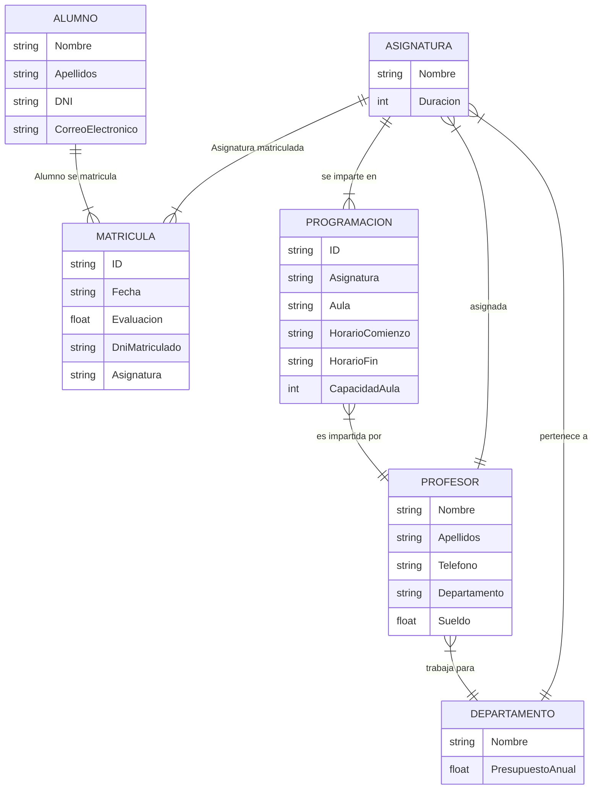

Francisco López Guerrero
10/Julio/2024

### Ejercicio 1.1
1: B

2: C

3: E

4: C

5: F

6: C

7: E

8: D

9: A

10: C

11: E

12: D

13: E

14: D

15: A

16: F

17: E

18: B

### Ejercicio 3.1


Restriccion textual:
```
"Una asignatura puede impartirse por más de un profesor, pero sólo en el caso de que haya más de una programación de esa asignatura."
"Cada programación sólo se imparte por un profesor"
```
Es decir: El numero de programaciones de una asignatura es igual al numero de profesores que imparten esa asignatura.

Apunte:
En caso de no haber profesores suficientes como para añadir programaciones a una asignatura o que por otra razon no hay suficientes programaciones, el numero de la relacion "se matricula en" se vera condicionado por la capacidad de las aulas asignadas a la programacion de la asignatura.

### Ejercicio 3.2
### 1) Crear una consulta para obtener los nombres y apellidos de todos los profesores que tengan un salario superior a 30.000€ y pertenezcan a un departamento con un presupuesto superior a 200.000€.
```SQL
SELECT PROFESOR.Nombre, PROFESOR.Apellidos
FROM PROFESOR
INNER JOIN DEPARTAMENTO ON PROFESOR.DepartamentoID = DEPARTAMENTO.ID
WHERE PROFESOR.Sueldo > 30000
AND DEPARTAMENTO.PresupuestoAnual > 200000;
```

### 2) Establecer una duración de 50 horas para todas las asignaturas cuya duración sea menor de 50 horas.
```SQL
UPDATE ASIGNATURA
SET Duracion = 50
WHERE Duracion < 50;
``` 

### 3) Borrar todos los datos relacionados con el estudiante que tiene el DNI 33444555K.
```SQL
DELETE FROM ALUMNO
WHERE DNI = '33444555K';
```


